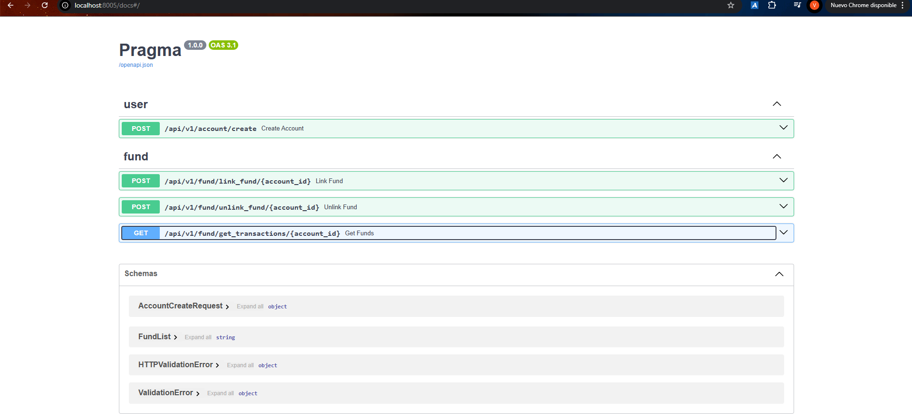

# Test

Este proyecto es una aproximación inicial al comportamiento de fondos de inversión utilizando un stack de tecnología base que permite hacer operaciones CRUD iniciales para apertura y cancelación de fondos, así como generar listado de transacciones de cuentas en períodos de tiempo.

## Requisitos previos

Para que el proyecto funcione es necesario tener instalado:

- [Docker](https://www.docker.com/products/docker-desktop) (incluye Docker Compose)
- [Python 3.12](https://www.python.org/downloads/) (Si se desea correr la aplicacion sin utilizar Docker)
- [MongoDB Compass](https://www.mongodb.com/products/tools/compass) (Para revisar la trazabilidad de los documentos en las colecciones de la DB)

## Pasos para ejecutar la aplicación en local

1. Clonar este repositorio:

```bash
git clone <url_del_repo>
cd <repositorio>
```

2. Crear un arvhivo ```.env``` que contenga las siguientes variables:

```
MONGODB_URL=mongodb://mongo:27017
DATABASE_NAME=<database_name>
CORS_ORIGINS=["http://localhost", "https://localhost"]
```

3. Ejecutar el comando ```docker-compose up --build``` en la terminal del proyecto

4. (Solo para la primera vez) En una nueva terminal, ejecutar el siguiente listado de comandos:

    - ```docker exec -it mongo bash``` se conecta al contenedor de Mongo 
    - ```mongosh``` abre la terminal de Mongo
    - ```use <database_name>``` genera la base de datos donde se alojarán los documentos en las colecciones de la app. **Importante** asegurar que sea el mismo nombre utilizado en el paso 2
    - ```db.createCollection(accounts)``` para crear la colección de cuentas
    - ```db.createCollection(transactions)``` para crear la colección de transacciones

5. Ir a http://localhost:8005/docs y revisar que el swagger de la app se vea similar a 

6. Para detener el proyecto utilizar ```docker-compose down```