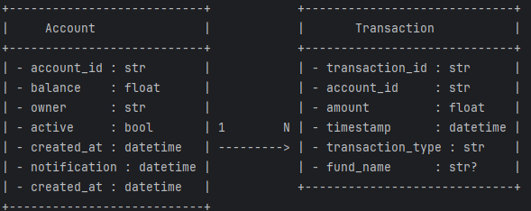
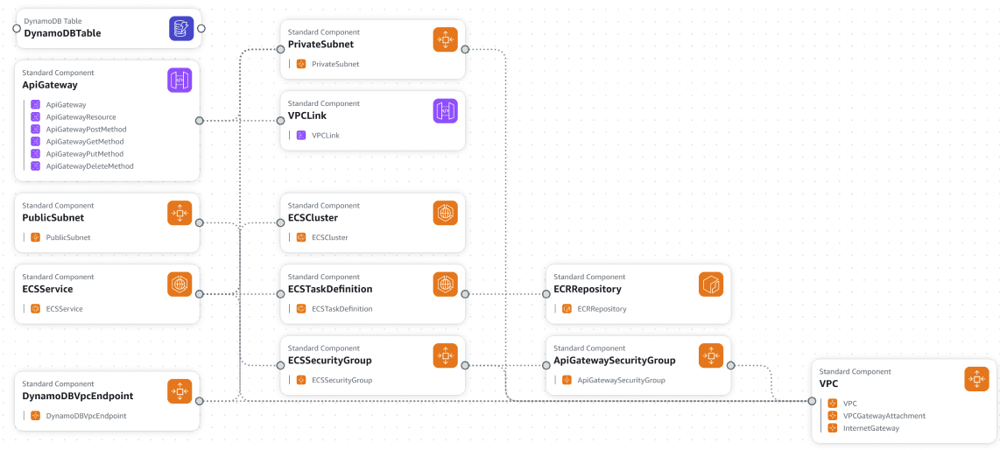

# Respuesta a prueba técnica

## Parte 1

1. Para asegurar que la aplicación funcione de manera correcta a nivel productivo, podria sugerir:

    - Utilizar servicios AWS para la alta disponibilidad de la aplicación, tales como:
      - IAM: que asegure que solo personas y servicios (roles) puedan acceder a la infraestructura
      - VPC: Para asegurar que solo los servicios que deban tener acceso a Internet, lo tengan, es decir, aislar servicios que no deberían estar conectados a Internet
      - Security Groups: para controlar el tráfico hacía el contenedor ECS donde se alojaría la app
      - ECR: Para tener las imagenes construidas en un registry privado que permita hacer los despliegues de las ultimas imagenes construidas
      - ECS: Para la ejecucion de los contenedores. Podria usarse instancias EC2 pero requeririan la administracion de las mismas.
      - DynamoDB: Para la base de datos NoSQL administradas por Amazon y qu epermite manejar colecciones y documentos
      - API Gateway: Para gestionar la entrada a la aplicación a través de un único puerto y enrutándolo de manera controlada
      - EventBridge: Para la captura de eventos de notificaciones a las cuentas cuando haya un movimiento en los fondos (apertura o cancelacion)
      - Lambda: Para procesar el evento y generar el mensaje de notificacion
      - SNS: Para distribuir las notificaciones a los dispositivos deseados (SMS o Email)
    - Terraform: Utilizar IaC para realizar el despliegue de la infraestructura de manera controlada, idempotente, repetible y gestionada.
    - Jenkins: Para generar los pipelines de CI/CD y despliegue la infraestructura o el codigo cuando hayan pusheos a las ramas
    - Git & Github: Para controlar el versionamiento del codigo y tener codigo mantenible y que permita el aporte colaborativo
    - New Relic: Para realizar el monitoroe en tiempo real de la aplicacion (Puede ser reemplazado por CloudWatch, X-Ray, CloudTrail y Grafana)


2. Modelo de datos NoSQL:



3.

Este proyecto es una aproximación inicial al comportamiento de fondos de inversión utilizando un stack de tecnología base que permite hacer operaciones CRUD iniciales para apertura y cancelación de fondos, así como generar listado de transacciones de cuentas en períodos de tiempo.

## Requisitos previos

Para que el proyecto funcione es necesario tener instalado:

- [Docker](https://www.docker.com/products/docker-desktop) (incluye Docker Compose)
- [Python 3.12](https://www.python.org/downloads/) (Si se desea correr la aplicacion sin utilizar Docker)
- [MongoDB Compass](https://www.mongodb.com/products/tools/compass) (Para revisar la trazabilidad de los documentos en las colecciones de la DB)

## Pasos para ejecutar la aplicación en local

3.1. Clonar este repositorio:

```bash
git clone <https://github.com/victoragudelo561/pragma_test.git>
cd <repositorio>
```

3.2. Crear un arvhivo ```.env``` que contenga las siguientes variables:

```
MONGODB_URL=mongodb://mongo:27017
DATABASE_NAME=<database_name>
CORS_ORIGINS=["http://localhost", "https://localhost"]
```

3.3. Ejecutar el comando ```docker-compose up --build``` en la terminal del proyecto

3.4. (Solo para la primera vez) En una nueva terminal, ejecutar el siguiente listado de comandos:

    - ```docker exec -it mongo bash``` se conecta al contenedor de Mongo 
    - ```mongosh``` abre la terminal de Mongo
    - ```use <database_name>``` genera la base de datos donde se alojarán los documentos en las colecciones de la app. **Importante** asegurar que sea el mismo nombre utilizado en el paso 2
    - ```db.createCollection(accounts)``` para crear la colección de cuentas
    - ```db.createCollection(transactions)``` para crear la colección de transacciones

3.5. Ir a http://localhost:8005/docs y revisar que el swagger de la app se vea similar a 

3.6. Para detener el proyecto utilizar ```docker-compose down```

4. Para mayor información, en el directorio ```/cloudFormation``` se encuentra el archivo ```.yml``` para la revisión



## Parte 2

```sql
select distinct c.nombre
from client c
join inscripcion i on c.id = i.idcliente
join producto p on p.id = i.idproducto
join visitan v on c.id = v.idcliente
and d.idsucursal = v.idsucursal
where v.idsucursal in (
   select d.idsucursal
   from disponibilidad d
   where d.idproducto = p.id)
)
```
